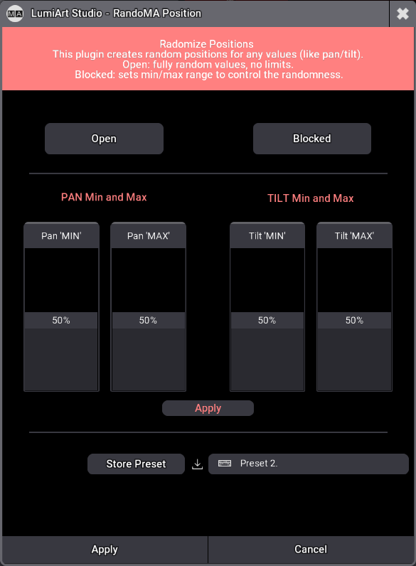
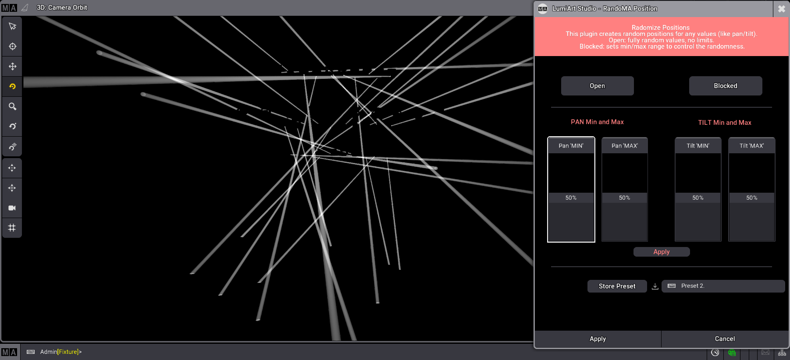
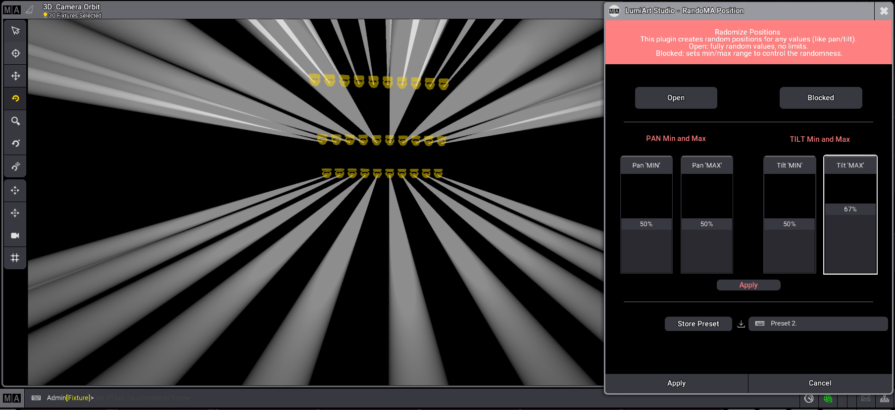
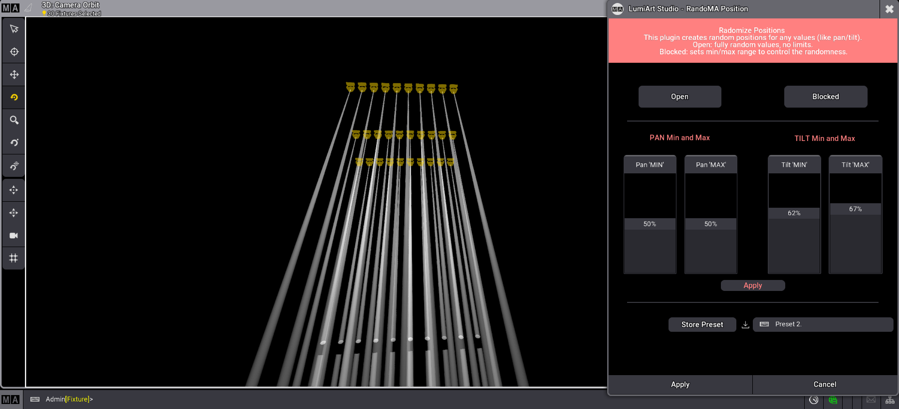
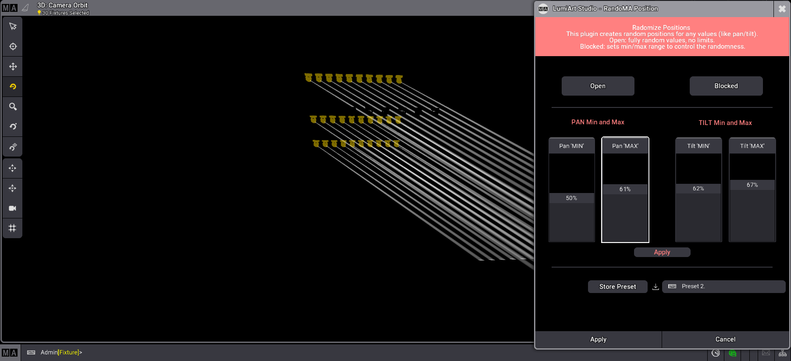
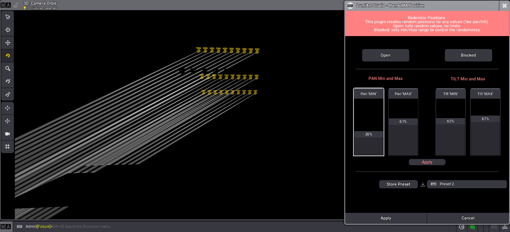
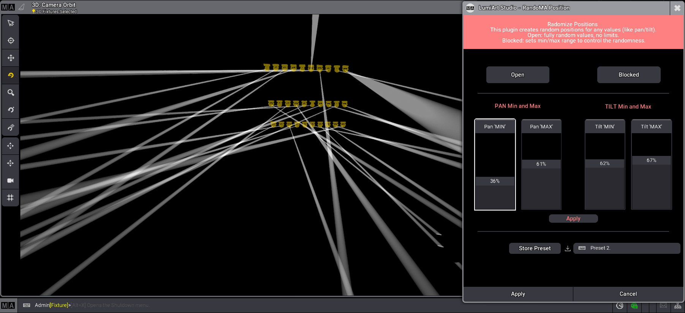

# Lumi Art Studio – RandoMA Positions v1.6

[](https://github.com/MayBeLinux/randoMA-Positions)
[](LICENSE)
[](https://github.com/MayBeLinux/randoMA-Positions/stargazers)
[](https://github.com/MayBeLinux/randoMA-Positions/issues)

---

## 🔮 Description  

**RandoMA Positions** is a plugin developed by **Lumi Art Studio** for **GrandMA3**.  
It allows you to quickly generate random positions (PAN / TILT) for the selected fixtures, in order to create asymmetrical and unpredictable looks.  

Two modes are available:  
- **Open** → completely random values.  
- **Blocked** → values defined by control faders within a (min / max) range.  

The plugin also includes:  
- Storage of custom presets.  
- A dedicated graphical interface (UI with buttons, faders, input fields).  
- Instant selection and application on chosen fixtures.  
 
---

## ⚙️ Installation  

1. Copy the file `RandoMA_Positions.lua` into your GrandMA3 plugins folder.  
   - Example:  
     ```
     C:\ProgramData\MALightingTechnology\gma3_library\datapools\plugins
     ```  
2. From the GrandMA3 console or onPC:  
   - Open the **Plugins window**.  
   - Right-click to add a plugin in the pool slot of your choice.  
   - Use the path selector (top right) to switch between __Internal__ and __USB Stick__ (USB drive name).  
   - Import the plugin.  
   - Run the plugin.  

---

## 🚀 Usage  

- **Step 1**: Select your fixtures.  
- **Step 2**: Open the plugin via the UI.  
- **Step 3**: Choose between:  
  - **Open** → fully random positions.  
  - **Blocked** → adjust PAN/TILT min and max using the faders.  
- **Step 4**: Click **Apply** to generate the positions.  
- **Step 5**: Save a preset if needed, using the text field and the __Store Preset__ button.

---

## 🛰️ Badges  

[](#)  
[](#)  
[](#)  
[](#)  

---

## Logo


## 🖼️ Screenshots  

| Interface | Example |
|-----------|---------|
| 🎨 Main UI |  |
| 🌀 PAN/TILT Random |  |

---

## 📝 Step-by-Step Usage with Images  

**Step 1 – Fader Tilt Max**  
Change the Tilt Max fader range.
  

**Step 2 – Fader Tilt Min**  
Change the Tilt Min fader range.
  

**Step 3 – Fader Pan Max**  
Change the Pan Max fader range.  
  

**Step 4 – Fader Pan Min**  
Change the Pan Min fader range.
  

**Step 5 – Blocked section result**  
Click on apply, and store the position into a preset.  
  

---

## 🤝 Contribution  

Contributions and suggestions are welcome.  
Please open an **issue** or a **pull request** in this repository.  

---

## 📜 License  

Distributed under the MIT License. See the [LICENSE](LICENSE) file for more information.  

---
